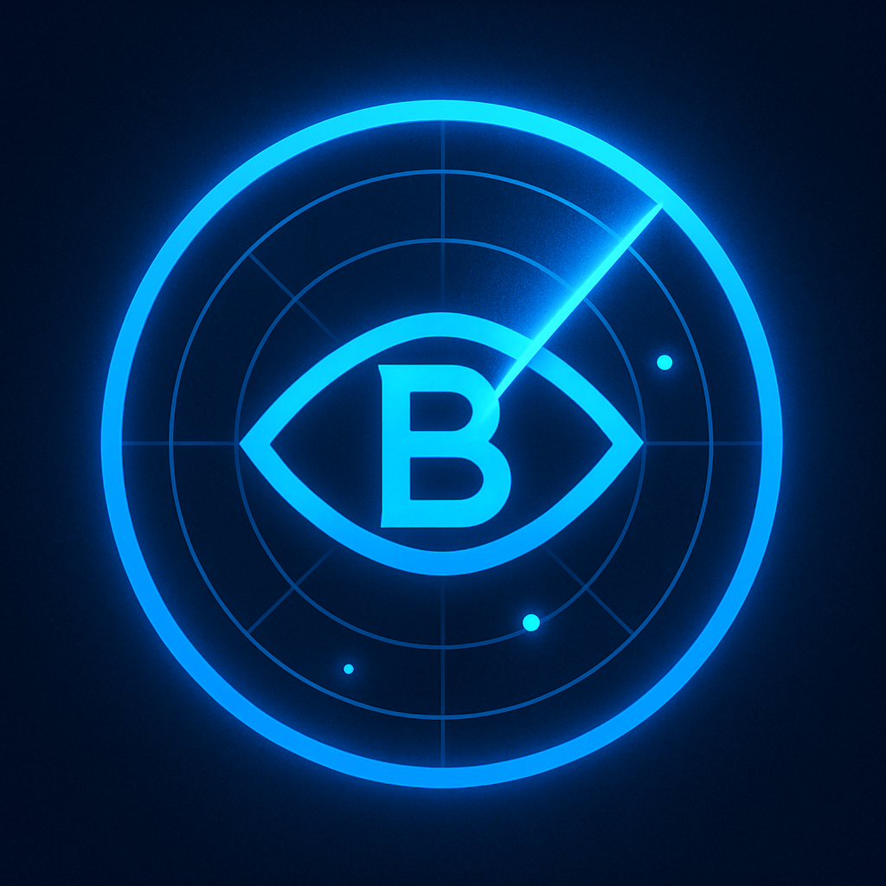

# BlueSight-SOC-Dashboard
SOC Threat Hunting project

# 🟦 BlueSight SOC Dashboard


## 🚨 Overview

**BlueSight SOC Dashboard** is an advanced, industry-level log analysis and visualization platform designed for Security Operations Center (SOC) and Blue Team professionals.

It parses authentication logs, detects suspicious behavior (such as repeated SSH brute-force attempts or root logins), and presents clean, real-time dashboards inspired by modern SIEM solutions.

---

## ⚡️ Features

- ✅ SSH brute-force detection (failed login attempts)
- ✅ Root login detection
- ✅ Suspicious IP tracking with dynamic thresholds
- ✅ Beautiful dark-mode dashboard with charts and tables
- ✅ Lightweight, fast, and easy to deploy

---

## 📊 Dashboard Preview

> 📸 _Add a screenshot here after running your dashboard_  
> Example placeholder:  
> 

---

## 🚀 Getting Started

### 1️⃣ Clone the repository

```bash
https://github.com/SyedMdAbuHaider/BlueSight-SOC-Dashboard
cd bluesight-soc-dashboard

